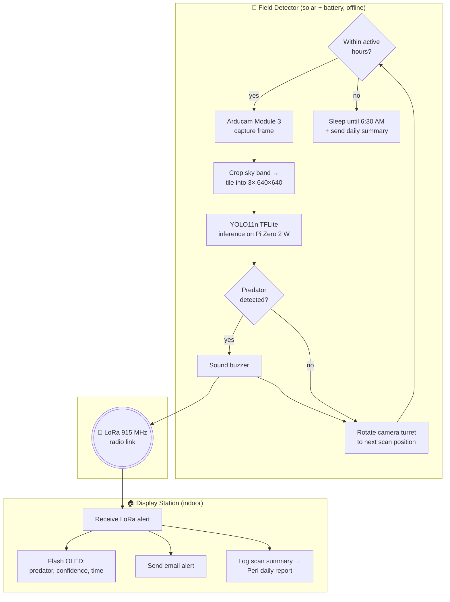

# SpotPredator

An AI-powered farm predator detection system built on Raspberry Pi Zero 2 W. SpotPredator uses a custom-trained EfficientNetB0 computer vision model to identify predators in real time, and alerts you wirelessly via LoRa radio — no internet required in the field with long range option. Free from monthly subscription plans.

---

## Overview

Farm animals face constant threats from hawks, eagles, foxes, coyotes, and other predators. SpotPredator provides an automated, low-cost, low-power monitoring solution that runs entirely offline in the field and notifies you at home the moment a threat is detected.

This is my first Raspberry Pi, computer vision, and soldering project — built from scratch with no prior hardware experience. There were cold joints, wrong pins, a buzzer that beeped all night, and a computer vision model that silently collapsed for two weeks before I caught it. I learned more from those mistakes than from anything that worked first try. The project is far from perfect — if you spot a bug, a better approach, or have suggestions, feel free to open an issue or pull request. Feedback is always welcome.

The system consists of two devices. Field detector code lives in `src/`, display station code lives in `display_station/`.

**Field Detector** — deployed outdoors near your animals
- Captures images on a scan interval using an Arducam Camera Module 3
- Runs AI inference locally using a fine-tuned **YOLO11n** object-detection TFLite model
- **Rotating camera turret** — a 28BYJ-48 stepper sweeps the camera in a center-out pattern for wider coverage
- Sounds a buzzer alarm on detection
- Transmits alerts wirelessly to your home via LoRa radio
- Sends heartbeat status updates every 30 minutes to keep you updated on system status
- Operates on a schedule (default 6:30 AM – 9:01 PM)
- **Solar + battery powered** — true off-grid operation, no WiFi required
- Housed in a **custom 3D-printed ABS enclosure** (field-validated through a Texas summer)

**Display Station** — sits indoors on your desk
- Receives LoRa alerts from the field device
- Shows predator type, confidence, and time on an OLED display
- Flashes the screen continuously until the threat clears
- Sends you an immediate email alert on predator detection
- Receives and logs a field scan summary report via LoRa
- Generates a Perl-based daily report with ASCII confidence graph

---

## Hardware

### Both Devices
| Component | Details |
|-----------|---------|
| Raspberry Pi Zero 2 W | Main compute unit |
| microSD card | 32GB+ recommended |
| 5V 2.5A power supply | For indoor/bench use |
| RYLR998 LoRa Module | 915MHz (US) / 868MHz (EU), up to 15km range |
| SFM-27-W Piezo Buzzer | 3-27V, loud alarm |
| 2N2222 NPN Transistor | Buzzer drive circuit |
| 1kΩ resistor | Transistor base resistor |

### Field Detector (additional)
| Component | Details |
|-----------|---------|
| Arducam Camera Module 3 | IMX708, autofocus, 12MP |
| 15-to-22 pin FFC cable | Required for Pi Zero camera connector |
| DS3231 RTC Module | Real-time clock with CR2032 battery |
| 12V LiFePO4 Battery (10Ah) | Field power supply |
| 12V → 5V DC-DC Converter (3A) | Powers the Pi from battery |
| 30W solar panel |

### Display Station (additional)
| Component | Details |
|-----------|---------|
| SSD1306 OLED Display | 128x64, I2C, 0.96 inch |

---

## AI Model

SpotPredator uses a custom fine-tuned **YOLO11 nano (YOLO11n)** object-detection model,
converted to TensorFlow Lite (FP16) for on-device inference on the Pi Zero 2 W.

- **Input**: 640x640 RGB image
- **Deployment classes**: `coyote`, `fox`, `raptor`
- **Confidence threshold**: 0.7 (configurable)
- **Runtime**: `tflite_runtime` / `ai-edge-litert` (CPU, XNNPACK)
- **Trained on**: author-collected field images + LILA BC + GBIF imagery

The model is published on Hugging Face (with usage code, classes, and limitations):
👉 **https://huggingface.co/JZVince/predator_v2_fp16**

**Small-object optimization**: predators often occupy only 20–40 px in a 1920×1080 frame.
The pipeline crops the sky band (keeping a 1920×640 ground strip) and tiles it into three
640×640 patches (left/middle/right) — so each patch gets the full resolution budget and
distant predators appear larger to the model. The same crop+tile is applied at training and
inference so the images match.

> **Model history / lesson learned**: This project started with an EfficientNetB0 classifier
> (`background`/`poultry`/`predator`) before moving to YOLO11n object detection for better
> localization of small, distant animals. Key lesson: **before deploying, test your model on
> fresh local images and confirm reasonable output.** My original classifier was silently
> returning ~66% "background" for every scan for two weeks — I only noticed because I happened
> to check, not because anything failed (luckily no poultry were lost in that window).

---

## How It Works



**Heartbeat:** every 30 minutes the field device also sends a status heartbeat over LoRa so
the display station knows the system is alive. **No WiFi or internet is needed between the two
units** — all field-to-home communication is direct LoRa radio.

---

## Installation

### 1. Flash Raspberry Pi OS

Use [Raspberry Pi Imager](https://www.raspberrypi.com/software/) to flash **Raspberry Pi OS Lite (64-bit)** to your microSD card. Enable SSH and configure WiFi in the imager settings before flashing.

> **WiFi tip**: Raspberry Pi Zero 2 W only supports 2.4GHz WiFi. If you have trouble connecting, disable WiFi 6 mode and roaming assistant on your router, and separate your 2.4GHz and 5GHz networks.

### 2. Enable Required Interfaces

```bash
sudo raspi-config
```

Enable the following:
- Camera (libcamera) — field detector only
- I2C
- Serial Port — **disable serial console, keep serial hardware enabled**

Then reboot:
```bash
sudo reboot
```

### 3. Clone the Repository

```bash
git clone https://github.com/JZVince/spotpredator.git
cd spotpredator
```

### 4. Run the Setup Script

A setup script handles everything — dependencies, virtual environment, data directories, systemd service, and crontab.

**Field Detector:**
```bash
chmod +x scripts/setup_field.sh
./scripts/setup_field.sh
```

**Display Station:**
```bash
chmod +x scripts/setup_display.sh
./scripts/setup_display.sh
```

The display station script will prompt you for your Gmail address, App Password, and WiFi connection name during setup.

> To get a Gmail App Password: Google Account → Security → 2-Step Verification → App Passwords.
> To find your WiFi connection name: `nmcli connection show`

### 5. Configure the System

Edit `config.yaml` to match your setup:

```yaml
detector:
  confidence_threshold: 0.85   # Raise to reduce false positives

hardware:
  lora:
    frequency: 915              # 915 for US, 868 for EU
    network_id: 18              # Change if multiple LoRa networks nearby
  buzzer:
    gpio_pin: 27

detection:
  check_interval: 15            # Seconds between scans
  cooldown_period: 180          # Seconds before re-alerting same predator
  schedule_enabled: true
  start_hour: 6                 # Start scanning at 6:00 AM
  end_hour: 21                  # Stop scanning at 9:01 PM
  end_minute: 1
```

### 6. Place Your Trained Model

Copy your trained TFLite model and labels to the `models/` directory:

```
models/
├── predator_v2_fp16.tflite
└── labels.txt
```

You can download the published model from Hugging Face:
**https://huggingface.co/JZVince/predator_v2_fp16**

`labels.txt` should contain one class per line:
```
background
poultry
predator
coyote
fox
raptor
```

### 7. Reboot

```bash
sudo reboot
```

The systemd service will start automatically on boot.

---

## Wiring

See [WIRING.md](WIRING.md) for full pin diagrams for both devices.

> **Soldering tip**: If soldering for the first time, flux is your best friend. It cleans metal surfaces, helps solder flow properly, and prevents cold joints.

---

## Troubleshooting

### Cannot SSH into Pi — connection refused or times out
- Before assuming hardware failure (SD card, cable, Pi itself), check your router first
- Pi Zero 2 W only supports **2.4GHz WiFi** — if your router broadcasts a combined 2.4/5GHz network, the Pi may fail to connect
- I'm not saying 5GHz won't work completely, but sure I had a lot issue with it.
- Disable **WiFi 6 (802.11ax)** mode on your router — Pi Zero 2 W does not support it
- Disable **roaming assistant** or **band steering** on your router — these features can kick pi devices out of connection due to low signal strength.
- Separate your 2.4GHz and 5GHz into two distinct networks and connect the Pi to the 2.4GHz one explicitly. A lot older devices work the best with 2.4GHz, same result for my BambuLab Printer and regular printer.
- After changing router settings, re-flash the SD card with the correct WiFi credentials and try again

### Camera not working
- Reseat the ribbon cable firmly — this is the most common cause
- Run `libcamera-hello` to test
- Enable camera in `raspi-config` and reboot

### LoRa not responding
- Verify VCC is on **Pin 17 (3.3V)**, not Pin 18 (GPIO)
- Check TX/RX are crossed between Pi and LoRa module
- Ensure serial console is disabled in `raspi-config`
- Both devices must use the same frequency and network ID

### RTC resetting to year 2000
- CR2032 battery contact is loose — press firmly and bend the spring contact
- Replace battery if old
- Reseat all RTC jumper wires

### Buzzer beeping continuously
- Usually caused by RTC I2C errors interfering with GPIO
- Reseat RTC module wires and reboot
- Check `buzzer_enabled` in `config.yaml`
- Possible soldering issue

### Station Display Device WiFi not reconnecting
- Run `nmcli connection show` and verify autoconnect is `yes`
- Disable WiFi power saving: `sudo iw dev wlan0 set power_save off`
- Add `autoconnect-retries=0` to your `.nmconnection` file for unlimited retries

### Model producing identical confidence scores for every scan
- Test with a known image: does inference output change with different inputs?
- If probabilities are identical regardless of input — model has collapsed, retrain required
- Common causes of model collapse:
  - **Learning rate too high during fine-tuning** — destroys pretrained ImageNet weights early in training, leaving the model unable to generalize
  - **Too many background images** — if background heavily outnumbers other classes, the model learns to always predict background as a safe default
  - **Imbalanced dataset** — aim for roughly equal class sizes; background should be a small fraction (~10-15%) of total images
  - **Augmentation too aggressive** — heavy distortion during training can prevent the model from learning meaningful features
- Before deploying any retrained model, always test it locally with a few known images and confirm confidence scores change with different inputs

---

## Future Plans

- Keep growing the field-image dataset for better real-world accuracy
- Expand predator classes with more species-specific training data
- Add active homing (limit switch / hard stop) so the camera turret can recover an exact
  reference position after a power loss mid-rotation
- Add a physical button on the display station to acknowledge and clear alerts
- Explore ESP32 as a lower-cost alternative for the display station
- Write an app for quick installation

---

## License

**Project code, hardware, and 3D models:** MIT License — feel free to modify and adapt.

**AI model** (`predator_v2_fp16`, published separately on Hugging Face): **AGPL-3.0**, because
it is fine-tuned from [Ultralytics YOLO11](https://github.com/ultralytics/ultralytics) (AGPL-3.0)
and derivative models inherit that license. See the
[model card](https://huggingface.co/JZVince/predator_v2_fp16) for details.

---

Built for protecting farm animals from predators using accessible, low-cost hardware and open-source AI.
